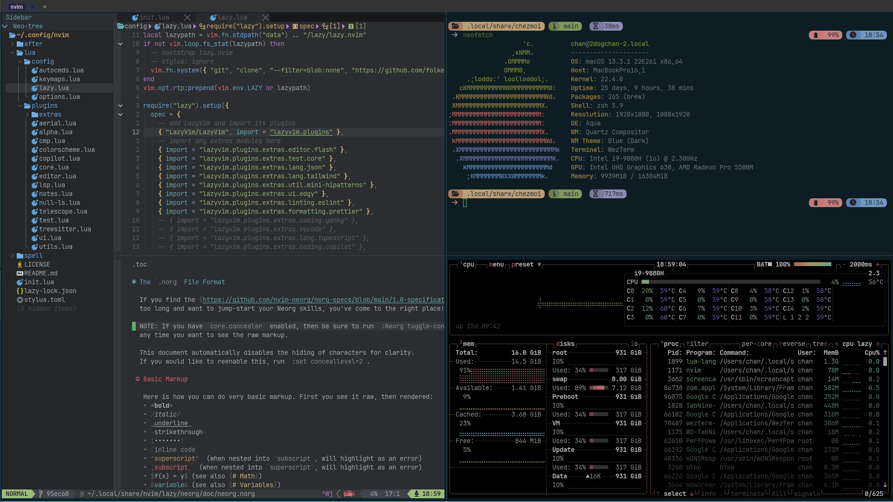

# dotfiles

macOS 开发环境，用 [chezmoi](https://chezmoi.io) 管理。zsh + WezTerm + Neovim（[独立仓库](https://github.com/2dogchan/lazy-nvim-ide)）。



## 新机器

```sh
brew install chezmoi
chezmoi init --apply https://github.com/2dogchan/dotfiles.git   # 会问 git 用户名和邮箱
```

`apply` 会顺带：拉取 Neovim 配置和 zsh 插件（`.chezmoiexternal.toml`），`Brewfile` 变化时跑 `brew bundle`。

## 结构

```
.chezmoi.toml.tmpl       首次 init 时询问的变量（name / email）
.chezmoiexternal.toml    外部依赖：nvim 仓库、zsh 插件（每周自动刷新，chezmoi apply -R 强制）
.chezmoiremove           已迁移/退役的目标文件，apply 时删除
.chezmoiscripts/         run_onchange_*：Brewfile 变化时 brew bundle
Brewfile                 Homebrew 清单（不部署到 $HOME；用 `brewfile` 别名从本机重新导出）

dot_zshenv               → ~/.zshenv      只放环境变量和 PATH，所有 zsh 都读
dot_config/zsh/          → ~/.config/zsh  (ZDOTDIR)
  dot_zprofile             登录时：Homebrew、ruby/coreutils、OrbStack
  dot_zshrc                只负责按顺序加载 conf.d/
  conf.d/10-options        选项、历史
  conf.d/20-completion     compinit 和补全样式
  conf.d/30-plugins        autosuggestions / autopair / alias-tips / auto-notify / syntax-highlighting
  conf.d/40-tools          zoxide、starship、fzf、bun
  conf.d/50-aliases  60-functions  70-fzf  80-keybindings
  plugins/                 由 chezmoi 下载，不入库

dot_config/git/          → ~/.config/git  (XDG 路径，取代 ~/.gitconfig ~/.gitignore ~/.gitmessage)
  config.tmpl  ignore  message
dot_config/wezterm/      wezterm.lua 入口；config/ 选项，events/ 状态栏和标签，utils/ 工具，colors/
dot_config/{bat,btop,lazygit,rg,starship.toml}
dot_local/bin/           自用脚本
private_Library/         Typora 主题
```

## 私密内容放哪

- 环境变量 / API key：`~/.zshenv.local`（`.zshenv` 末尾自动加载）
- git 身份覆盖、签名 key：`~/.config/git/config.local`
- 壁纸：`~/Pictures/wezterm-backdrops/`（WezTerm 随机取，目录为空则无背景）

这三处都不在仓库里。

## 日常

```sh
chezmoi diff        # 本机和仓库的差异
chezmoi re-add      # 把本机修改收回仓库
chezmoi apply       # 把仓库应用到本机
chezmoi cd          # 进源目录提交
brewfile            # 重新导出 Brewfile
```
